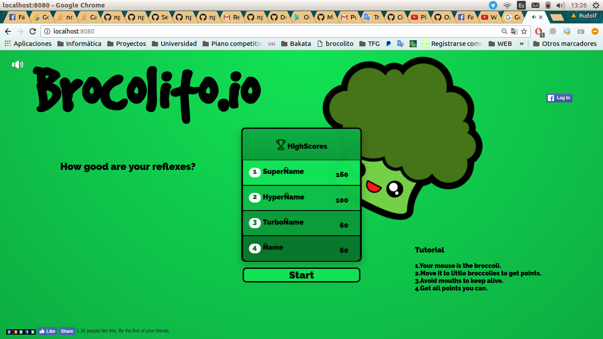

## BROCOLITO.IO

[Brocolito.io](http://www.brocolito.io) is a videogame developed in javascript using the [Phaser library](http://www.phaser.io) which purpose is just having fun testing your speed and reflex skills.

### How to play
Your mouse is the broccoli and the main goal is to get all the broccoli you can avoiding the malicious mouths.

### Dependencies
  - Phaser.io
  - Math.js
  - gyro.js
  - jQuery
  - express.js
  - heroku

### License
This project is under a [GNU GENERAL PUBLIC LICENSE](LICENSE)

## Author
[Rudolf Cicko](http://www.github.com/cicko) is the unique author of this project.
